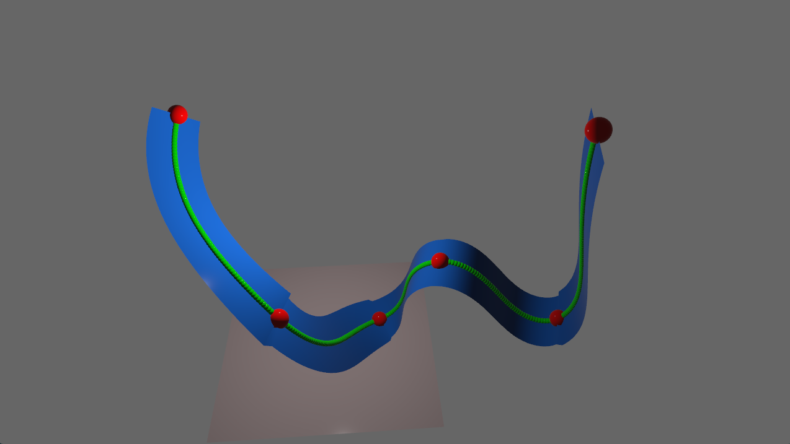

# coasters

Rollercoaster simulation written using [Bevy](https://bevyengine.org/). Press `Enter` to begin the ride, `q` to exit at any point.

The track is generated using [pythagorean hodograph splines](https://github.com/suremarc/pythagorean-hodographs), a spline that has some useful analytic properties. On an Intel(R) Core(TM) i7-9750H CPU @ 2.60GHz, generating a spline of 8 segments takes about 25 microseconds, and rendering the spline as shown below takes another 100 microseconds.

Some desirable and/or interesting features for the future:

* Real-time drag-and-drop editing of spline controls points & orientations
* Visualization of velocity over time (and detection of stalling)
* "Booster" segments that boost the player's velocity in a certain region
* Exporting tracks to a file

## Instructions to run

To run this project, simply do `cargo run --release`. That's it!
