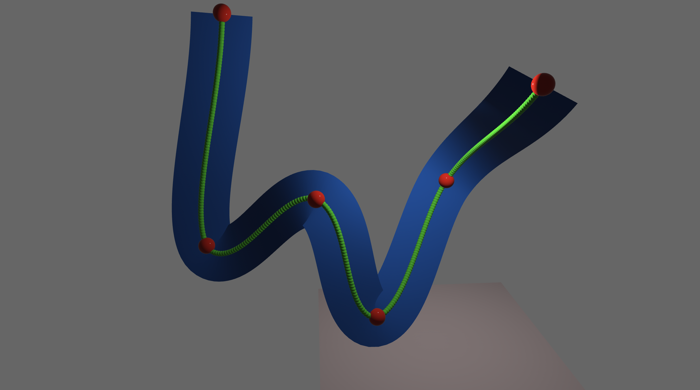

# coasters

Rollercoaster simulation written using [Bevy](https://bevyengine.org/). Press `Enter` to begin the ride, `q` to exit at any point.

The track is generated using [pythagorean hodograph splines](https://github.com/suremarc/pythagorean-hodographs), a spline that has some useful analytic properties. Generating a spline of 10 segments takes about 30 microseconds, and rendering the spline as shown below takes another 100 microseconds.

In the future I plan to add real-time drag-and-drop for the controls points.

## Instructions to run

To run this project, simply do `cargo run --release`. That's it!
